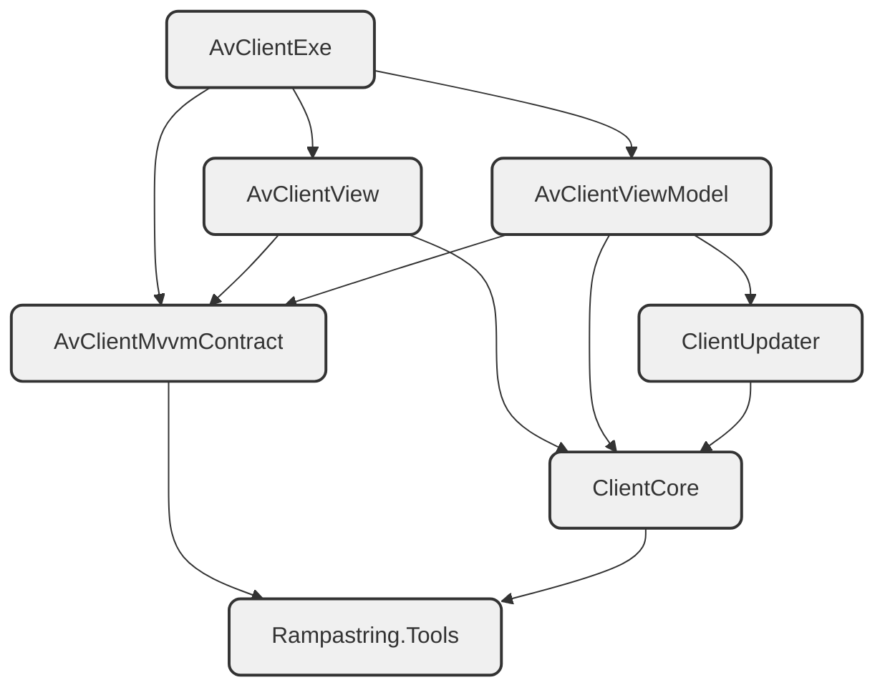

# CnCNet Client

**MVVM migration is in progress. This branch is in a very early stage, and is quite away from completed. Do not use it now. Also, the commits will be squashed in the end.**

```diff
-Rampastring.XNAUI
-ClientGUI
-DXMainClient
+AvClientMvvmContract
+AvClientViewModel
+AvClientView
+AvClientExe
```

