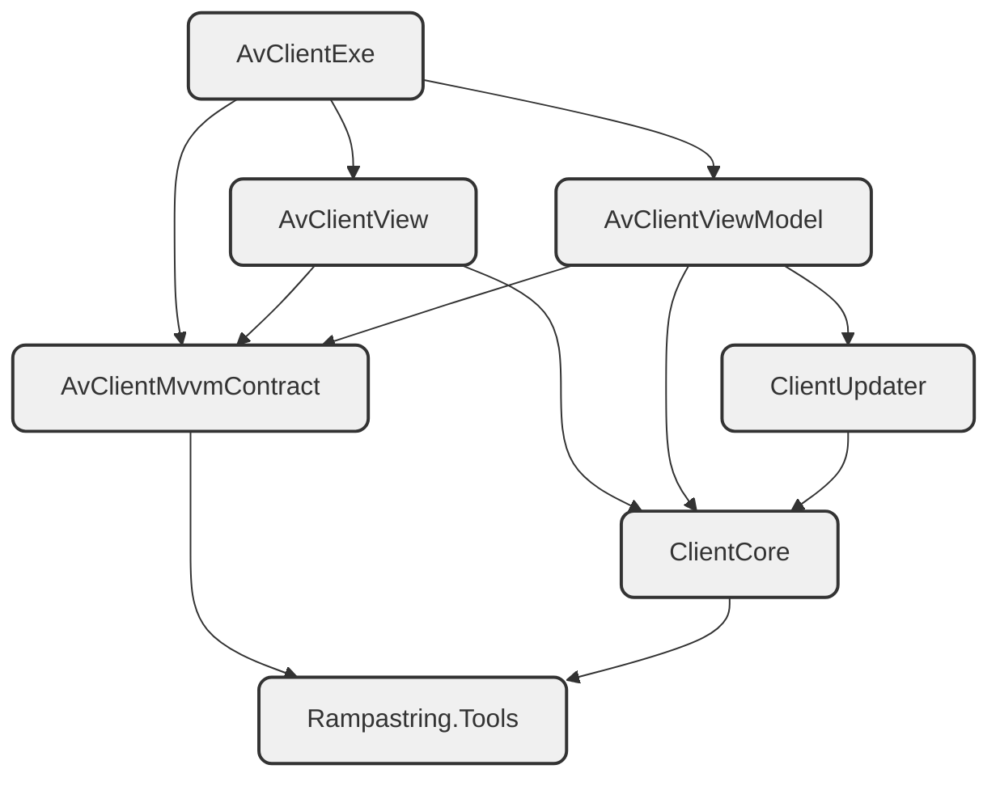

# CnCNet Client

**MVVM migration is in progress. This branch is in a very early stage, and is quite away from completed. Do not use it now. Also, the commits will be squashed in the end.**

## Early test

1. Download and install CnCNet YR
2. Build or download the latest build
3. Remove `Binaries` and `BinariesNET8` folders in the YR `Resources` directory (make a backup to switch back to the old client)
4. Extract the `Binaries` and `BinariesNET8` folders in the build output to the YR `Resources` directory
5. Run `clientav.exe` from `Resources\Binaries` to launch the client. Do not use `CnCNetYRLauncher.exe`.

Note: expect a lot of bugs, massive bugs, tons of bugs. Report them in the issue tracker.

## Structure

```diff
-Rampastring.XNAUI
-ClientGUI
-DXMainClient
+AvClientMvvmContract
+AvClientViewModel
+AvClientView
+AvClientExe
```

