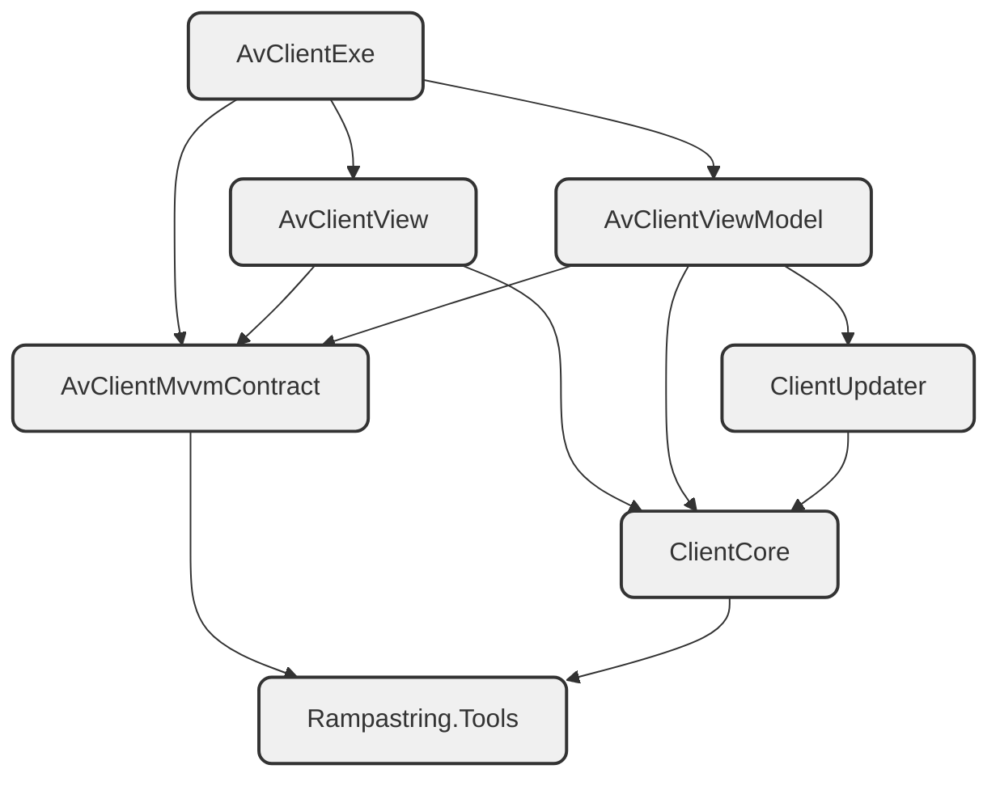

# CnCNet Client

**MVVM migration is in progress. This branch is in a very early stage, and is quite away from completed. Do not use it now. Also, the commits will be squashed in the end.**

## Early test

1. Download and install CnCNet YR
2. Build or download the latest build
3. Remove `Binaries` and `BinariesNET8` folders in the YR `Resources` directory (make a backup to switch back to the old client)
4. Extract the `Binaries` and `BinariesNET8` folders in the build output to the YR `Resources` directory
5. Run `clientav.exe` from `Resources\Binaries` to launch the client. Do not use `CnCNetYRLauncher.exe`.

Note: expect a lot of bugs, massive bugs, tons of bugs. Report them in the issue tracker.

## Motivation

1. The client mixes GUI codes with logic codes. Compared with an MVVM pattern, the code is harder to maintain.
2. Isolating the UI codes (the View project) allows modders who want a more aggressive UI tweaking playing with their own UI designs using their AI without fearing to break the client's functionality. The view model is designed to run even without a view.
3. We currently release the client in 7 variants -- a lot. If we add the video/animation support in the future, the DLL files will significantly grow. We even have two different versions of pending video support PRs.
4. I saw how hard it is to add the TTF support. I don't want developers spend all their time in implementing existing commonly and widely used GUI features.
5. The client does not need a game-level per-frame control. Avalonia provides a more efficient rendering and consumes less CPU and GPU resources.
6. 4K monitors are very cheap now. The client does not render text in an optimal way if the client scales at e.g. 200%  even we tried our best when adding TTF support.

## Structure

```diff
-Rampastring.XNAUI
-ClientGUI
-DXMainClient
+AvClientMvvmContract
+AvClientViewModel
+AvClientView
+AvClientExe
```

